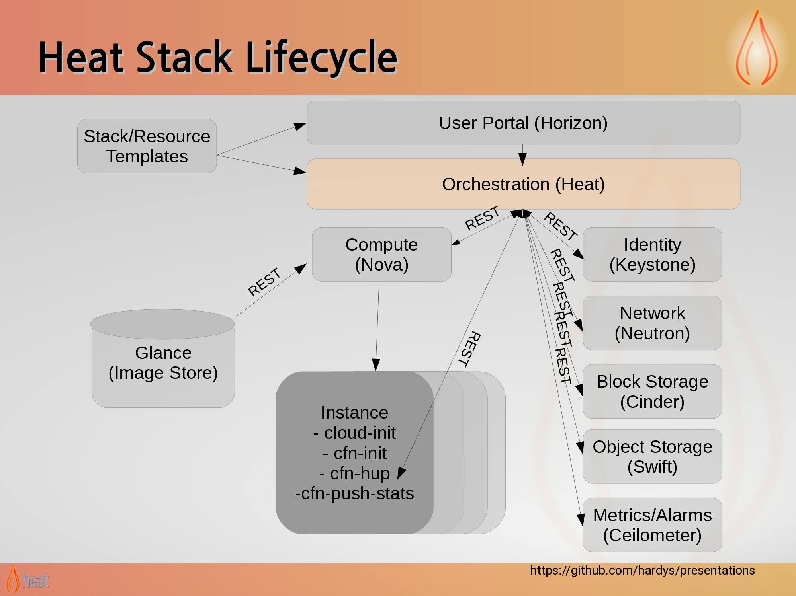

HEAT
----

Some examples of resource:

      resource:
        type: OS::Nova::Server
        properties:
          flavor: { get_param: flavor }
          image: { get_param: image }
          metadata: {"scale_group": {get_param: "OS::stack_id"}}
          networks:
          - network: private
          security_groups:
          - testvm

---
## Some of the resouce groups relevant today for us are:
- *OS::Heat::AutoScalingGroup*
- *OS::Heat::ScalingPolicy*
- *OS::Monasca::Notification*
- *OS::Monasca::AlarmDefinition*

---
## OS::Heat::AutoScalingGroup
Properties:
  - **name:** Convenient name.
  - **max_size:** Maximum size of the group.
  - **min_size:** Minimum size of the group.
  - **desired_capacity:** Initial Capacity of the group.
  - **cooldown:** minimum time before *any* autoscaling related operation.
  - **resources:** set of resource that should be scaled up or down.

Example:

    group:
      type: OS::Heat::AutoScalingGroup
      properties:
        ... specify propoerties from above ..
        resource:
          type: OS::Nova::Server
          properties:
            flavor: { get_param: flavor }
            image: { get_param: image }
            # pass scale_group as metadata,
            # monasca will store this as vm metadata and
            # later can be used to group vms together from
            # same stack
            metadata: {"scale_group": {get_param: "OS::stack_id"}}
            networks:
            - network: private
            security_groups:
            - testvm

---
## OS::Heat::ScalingPolicy
Properties:
  - **change**: a number that has an effect based on change_type.
  - **auto_scaling_group_id**: the AutoscalingGroup id for this policy.
  - **scaling_adjustment**: change in number (eg: 1,-1,5,-6).
  - **change_type:** (meaning of "change")
  	- "change_in_capacity"
    - "percentage_change_in_capacity",
    - "exact_capacity"
  - **cooldown:** minimum amount of time (in seconds) between allowable executions of this policy.
  - **name:** Convenient name

Attributes: (outputs)
  - **alarm_url**: the url which triggers the policy

Example:

    policy_for_autoscaling_group:
      type: OS::Heat::ScalingPolicy
      properties:
        adjustment_type: change_in_capacity
        auto_scaling_group_id: { get_resource: group }
        cooldown: 60
        scaling_adjustment: -1

---

## OS::Monasca::Notification
Properties:
  - **address**: Address of the notification.
        - email address
        - url
        - service key based on notification type.
  - **type**: Type of the notification.
        - email
        - webhook
        - pagerduty

Example:

	notification_object:
      type: OS::Monasca::Notification
      properties:
        type: webhook  # we want the notification to trigger the policy via a url
        address: {get_attr: [some_policy, alarm_url]} # this get the alarm_url to trigger the policy

---

## **OS::Monasca::AlarmDefinition**
Properties:
- **expression**: Expression of the alarm to evaluate.

    eg: `avg(cpu.utilization_perc{group_by=something}) > 50 times 3`

Optional Properties
- **alarm_actions**
- **ok_actions**
- **undetermined_actions**
- **actions_enabled**
- **match_by**
- **severity**
- **description**
- **name**

Example:

	fire_alarm:
    type: OS::Monasca::AlarmDefinition
    properties:
      ....
      expression:
        str_replace:
          template: avg(cpu.utilization_perc{scale_group=group_by}) > 50 times 3
          params:
            group_by: {get_param: "OS::stack_id"} # use stack_id to group instances
      severity: high
      alarm_actions:
        - {get_resource: notification_object_from_the_stack }
---

## Big Picture

	AlarmDefinition >>> has
  		Notification   >>> triggers
			ScalingPolicy     >>> scales up/down
				AutoScalingGroup  >>> Resources scaling by heat
